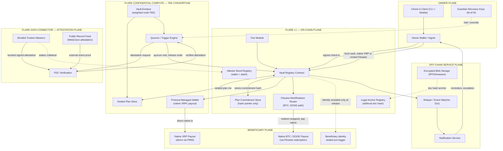
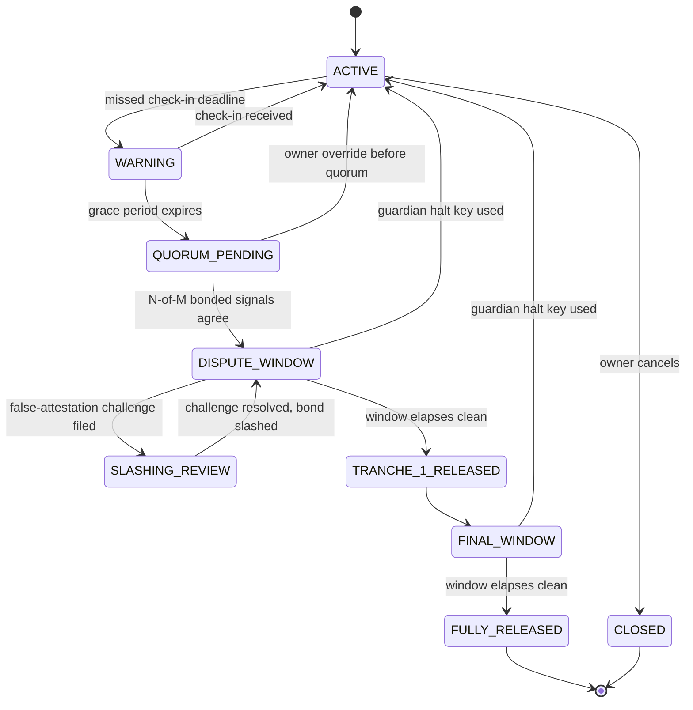
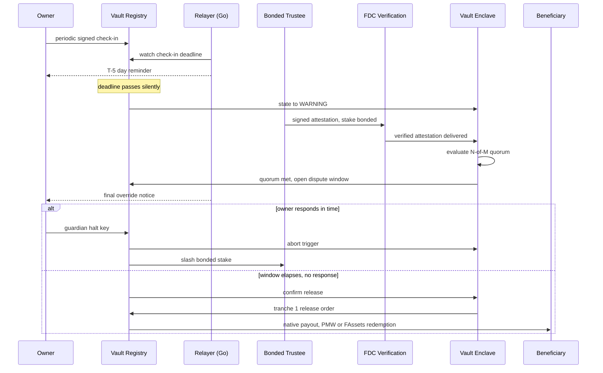

# Continuity Vault — High-Level Architecture

*Non-custodial estate & business-continuity protocol for XRP / BTC / DOGE holders — built on Flare Confidential Compute (FCC), Protocol-Managed Wallets (PMW), FAssets, and the Flare Data Connector (FDC).*

## Design Principles

1. **Trust-minimize the trigger, not just the custody.** A multisig protects funds at rest; it says nothing about *who decides the owner is gone*. That decision is the actual product — give it its own economically-secured subsystem, not one signature.
2. **Optimistic execution, not oracle execution.** Every trigger is provisional until a bonded challenge window closes — the pattern real probate already uses, and the one every "dead man's switch" clone skips.
3. **Minimize information exposure before execution, not after.** The real threat model is coercion of a known heir ("wrench attack"), not a contract bug. Attestors see a case ID, not an estate. Beneficiaries stay unknown on-chain until release.
4. **The owner can self-correct even mid-trigger.** A false positive — alive, unreachable for a legitimate reason — has to be recoverable *after* quorum is met, not only before, or the safety net is more dangerous than a will.
5. **Confidentiality is a means, not the pitch.** The TEE exists because the plan — who, how much, when — is exactly what regulators, family, and attackers all want pre-execution. That's the sentence that makes this need a TEE instead of a timelocked contract.
6. **One state machine, two markets.** Personal inheritance and business key-person continuity are the same trigger → quorum → release primitive with different beneficiaries. Don't build two products.
7. **Settle in the asset people understand.** Where PMW covers the source chain (XRPL, at launch), pay out natively — never leave a grieving beneficiary holding a wrapped token they've never heard of.

## System Architecture

## Component Responsibilities

| Plane | Component | Responsibility | Phase |
|---|---|---|---|
| Owner | Check-in Client | signed liveness proof on a cadence | 1 |
| Owner | Guardian Recovery Keys | halts a false trigger; auth path separate from the trigger path itself | 1 (single key) → 2 (M-of-N) |
| Flare L1 | Vault Registry | canonical state machine; holds plan commitment hash only | 1 |
| Flare L1 | Attestor Bond Registry | stake + slash logic for attestor honesty | 2 |
| Flare L1 | FAssets Mint/Redeem Router | BTC / DOGE funding + native payout at release | 1 (FXRP only) → 2 (BTC, DOGE) |
| Flare L1 | Legal Anchor Registry | stores keccak256(will/trust deed) for evidentiary linkage | 2 |
| Flare L1 | Fee Module | annual plan-maintenance fee, funds check-in infra | 2 |
| FCC | Vault Enclave | only component that ever decrypts the full plan | 1 |
| FCC | Quorum Engine | evaluates N-of-M weighted signals inside the enclave | 1 (2-of-2) → 2 (N-of-M, weighted) |
| FCC | Protocol-Managed Wallet | direct native-XRP payout, no wrapped-asset step | 2 (fresh Songbird primitive) |
| FDC | Bonded Trustee Attestors | signed secondary signal, stake at risk | 1 (single, unbonded) → 2 (bonded market) |
| FDC | Public-Record Feed | `Web2Json` attestation of obituary/court-filing APIs | 2 |
| Off-chain | Relayer / Watcher (Go) | watches on-chain deadlines, drives reminders | 1 |
| Off-chain | Notification Service | escalating email/SMS through the dispute window | 1 |
| Off-chain | Encrypted Blob Storage | sealed legal-doc + large plan data | 2 |

## Vault Lifecycle

## Trigger & Dispute Sequence

## Trust & Security Model

- The Vault Enclave inherits FCC's own security model — a **weighted consortium of TEEs**, not a single enclave — the same redundancy Flare built PMW around, so one hardware exploit or one data-center outage isn't a total break.
- Attestor bonding: stake sized as a multiple of expected payout, slashed into a beneficiary-compensation pool on a successful dispute.
- The guardian halt path is authorized separately from the trigger path, so recovery can never become a backdoor for early release.
- Blind attestation: a trustee's payload carries a case ID and attestation type only. Beneficiary identity, split, and plan contents never leave the enclave pre-trigger.
- Public-record signals ride FDC's `Web2Json` attestation type against obituary/court-filing APIs — the same proof machinery FAssets already uses for payment verification, not a bespoke oracle to trust.

## What Makes This Real, Not a Demo

- **Bonded, disputable attestation** instead of one lawyer's signature — trust becomes an economically-secured, appealable claim, the actual bar probate clears.
- **Wrench-attack-aware by construction** — trustees are blind to estate size, beneficiaries invisible on-chain pre-release. The biggest real objection to crypto inheritance, and almost nobody designs for it.
- **Override survives the trigger, not just precedes it** — guardian keys abort inside the dispute window and even after tranche 1, covering "went dark for a good reason."
- **Native settlement, not wrapped-token orphaning** — XRP beneficiaries are paid directly through a Protocol-Managed Wallet, no redemption step, no explaining FXRP to a grieving spouse.
- **Same primitive, two markets** — flip beneficiary from "heirs" to "backup signer" and the identical state machine sells as key-person business continuity to DAOs and founders, no separate build.
- **Evidentiary, not just technical** — anchoring keccak256(will) on-chain gives a court something to point at.

## Honest Risk Ledger

- TEE trust is still a hardware trust root at MVP; consortium-weighting mitigates but doesn't eliminate it.
- Bonded attestor market has a cold-start problem — day-one security looks closer to "single known trustee" than "market."
- PMW currently covers XRPL only; BTC/DOGE stay on the FAssets mint/redeem path until Flare extends PMW to those chains.
- Public-record coverage is jurisdiction-dependent — not every death or incapacitation produces a machine-readable feed.
- Large automatic transfers on death can trigger estate-tax/AML reporting that varies by jurisdiction; compliance hooks are a v2 requirement, not a footnote.
- Total key loss (check-in key + all guardian keys) defeats the safety net entirely — recovery UX is genuinely unsolved, not a checkbox.

## Tech Stack

- **Chain:** Flare Mainnet target; Songbird (FCC canary) / Coston2 for build + demo
- **Contracts:** Solidity — Vault Registry, Bond Registry, Fee Module, FAssets Router, Legal Anchor Registry
- **Confidential compute:** Flare Confidential Compute (TEE consortium) hosting the Vault Enclave + Quorum Engine
- **Attestation:** FDC — `Payment` / `AddressValidity` for FAssets flows, `Web2Json` for public-record signals
- **Settlement:** Protocol-Managed Wallet for native XRP; FAssets mint/redeem for BTC, DOGE
- **Off-chain:** Go relayer/watcher (goroutine-per-vault deadline fits this event-driven load naturally) + notifier, Postgres for relayer state, IPFS/Arweave for sealed blobs
- **Client:** CLI + lightweight mobile app for signed check-ins
