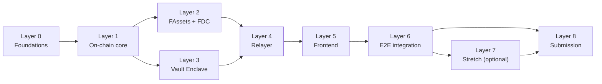

# Continuity Vault — Build Prompt

**For:** an AI coding agent (or dev team) building the *Flare Summer Signal* hackathon submission
**Companion file:** `continuity-vault-architecture.md` — provided alongside this prompt
**Deadline:** August 14, 2026 · **Written:** August 2, 2026

> ## Read this first — the attachment
> Alongside this prompt, I am providing `continuity-vault-architecture.md` in the same conversation. That file is the **authoritative system design**: the full architecture diagram, the component-responsibility table (with Phase 1 / Phase 2 tags per component), the vault-lifecycle state diagram, the trigger-and-dispute sequence diagram, the trust-and-security model, and the honest risk ledger.
>
> **Read that file in full before writing any code or scaffolding any repo.**
>
> This document is the **build order and scope guide**. It does not redefine the architecture — it tells you what to build first, second, third; what to leave for later; how to resolve the couple of places where the architecture is genuinely ambiguous about MVP timing; and how to package the result for judging. Whenever this prompt names a component (Vault Registry, Quorum Engine, FAssets Router, Legal Anchor Registry, Vault Enclave / FCE, etc.), it means exactly that component as diagrammed in the architecture file — do not rename or reinterpret it.
>
> **Assumptions this prompt makes:** a team of roughly 1–3 people, comfortable with Solidity and at least one backend language (Go or TypeScript/Node), starting from zero on August 2, 2026. If your situation differs — bigger team, a partial existing codebase, different skills — the layer *order* below still holds; just compress, expand, or reassign layers.

---

## 0. TL;DR

**What you're building:** a protocol where XRP/BTC/DOGE holders set up a private inheritance or business-continuity plan. A missed check-in *plus* an independent confirmation (never either signal alone) opens a public dispute window; if nobody halts it, funds release — in tranches, to beneficiaries who stay unknown on-chain until release.

**Why Flare, specifically, in one line each:**
- **FAssets** — the only reason XRP/BTC/DOGE holders can have "if I die, split this" logic at all; those chains have no native smart contracts.
- **FDC** — turns a human confirmation or public record into an on-chain fact, so the trigger is more than a timer.
- **FCC** — keeps the plan private until execution; a beneficiary list sitting in plaintext on a public contract is a real-world dealbreaker for this product category.

**Build order at a glance** (detail in Section 8):

| Layer | What | When |
|---|---|---|
| 0 | Repo, toolchain, testnet funds, hackathon registration | Day 1 |
| 1 | Vault Registry contract — the state machine, on Coston2 | Days 2–4 |
| 2 | FAssets funding/redemption + FDC attestation wiring | Days 5–6 |
| 3 | Vault Enclave — confidential-compute reference service | Days 7–8 |
| 4 | Relayer + notification service (Go) | Day 9 |
| 5 | Frontend — owner / trustee / beneficiary views | Day 10 |
| 6 | End-to-end integration + hardening | Day 11 |
| 7 | Stretch: business-continuity mode, M-of-N guardian, second attestation source | Day 12 |
| 8 | Submission packaging + demo video | Day 13 (Aug 14) |

Read Sections 2–3 before you start — they explain *why* this order is what it is, and flag two things your own source material leaves ambiguous.

---

## 1. Mission

You are acting as lead engineer — contracts, backend, and frontend — for a small team building **Continuity Vault**, a non-custodial digital-estate and business-continuity protocol for XRP/BTC/DOGE holders, for submission to the **Flare Summer Signal** hackathon on DoraHacks.

Continuity Vault lets a crypto holder define a private, multi-condition inheritance or business-succession plan — who receives funds (or signing authority), under what evidence, on what schedule — without ever putting that plan on a public chain in plaintext, and without trusting a single "dead man's switch" check-in as the only signal that something happened. The plan only becomes visible, and funds only move, after multiple independent signals agree *and* a public dispute window passes without the owner objecting.

Your job across this document: take the attached architecture and turn it into working software, in the right order, scoped realistically for the time actually available before the deadline.

---

## 2. Hackathon context, and how judging maps to this build

**Event:** Flare Summer Signal, hosted on DoraHacks — an open online hackathon with two bounty tracks: *interoperable asset products* (DeFi / XRP / FAssets) and *private applications built with Flare Confidential Compute*. Prize pool $12,000. Registration at dorahacks.io. **Submission deadline: August 14, 2026.**

Continuity Vault genuinely spans both tracks — FAssets funds and pays it out, FCC is what makes the private-plan mechanic possible at all. Select both bounties if the submission form allows more than one; the architecture earns it, this isn't a stretch to force a second track.

Every hackathon rewards a slightly different mix of things than "does it work." Here's the stated judging criteria and exactly where this build answers each one:

| Criterion | What judges are really asking | Where this build answers it |
|---|---|---|
| **Product usefulness** | Is there a real user with a real problem? | XRP/BTC/DOGE holders have no native way to encode inheritance logic — a real, underserved gap (this cohort skews older and higher-net-worth than the average crypto user). The same primitive resells as key-person continuity to DAOs/founders — a second, B2B market from one build. State both target users explicitly in Layer 8's submission writeup. |
| **Flare integration quality** | Is Flare load-bearing, or could this be "any EVM chain plus a cron job"? | Say, out loud, in the demo, why each primitive is necessary — the one-liners in Section 0. A judge should be able to ask "couldn't this just be a timelock contract?" and your answer should be a confident, specific no. |
| **Technical execution** | Does the demo actually run? Is the architecture legible? | Layer 6 exists entirely to make the full lifecycle (check-in → miss → attest → dispute → release) runnable end-to-end on a public testnet, not just diagrammed. Walk judges through the actual diagrams in `continuity-vault-architecture.md` rather than re-explaining the system from scratch. |
| **Evidence of new work** | What did you specifically build *during* the program? | Assumed here to be a from-scratch build — log it in `docs/SUBMISSION.md` as you go, starting Day 1, not Day 13. If any piece pre-dates the hackathon, split it explicitly: existed before / newly built / ported / improved — DoraHacks asks for exactly this breakdown. |
| **Clarity and future potential** | Can you explain it simply? Is there a believable Phase 2? | This is exactly what the architecture file's Phase 1 / Phase 2 tags and Honest Risk Ledger are for. Present them as-is — don't smooth them over. A team that says "here's what's real, here's what's roadmap, here's the risk we haven't solved" reads as more credible than one claiming everything works. |

---

## 3. Reality check before you write any code

### 3a. Your actual runway

This prompt assumes you're starting from zero on **August 2, 2026**, against the **August 14, 2026** deadline — 13 calendar days. If you're reading this later, keep the layer *order* and relative sizing, just compress the dates.

| Day | Date | Layer |
|---|---|---|
| 1 | Aug 2 | Layer 0 — Foundations |
| 2–4 | Aug 3–5 | Layer 1 — On-chain core |
| 5–6 | Aug 6–7 | Layer 2 — FAssets + FDC wiring |
| 7–8 | Aug 8–9 | Layer 3 — Vault Enclave |
| 9 | Aug 10 | Layer 4 — Relayer + notifications |
| 10 | Aug 11 | Layer 5 — Frontend |
| 11 | Aug 12 | Layer 6 — End-to-end integration |
| 12 | Aug 13 | Layer 7 — Stretch features |
| 13 | Aug 14 | Layer 8 — Package and submit |

Treat **Layer 6 as the real deadline**. If it slips past Day 11, drop straight to Layer 8 and skip Layer 7 entirely — a smaller thing that works beats a bigger thing that doesn't, on every one of the five judging criteria above.

### 3b. Where Flare's platform actually stands today (this moves fast — re-verify before Layers 2 and 3)

**FAssets:** FXRP is the only FAsset actually live on Flare Mainnet right now. FBTC has been tested on Songbird and is publicly described as coming later in 2026; FDOGE was tested on Songbird and later wound down for v1. This matches the architecture file's own MVP scoping exactly — **build against FXRP only**; leave FBTC/FDOGE as the Phase 2 row it already is in the component table.

**FCC / PMW:** Real and enshrined (alongside FTSO and FDC), and moving fast. A governance vote to deploy FCC to **Songbird** (not Coston2) ran July 6–13, 2026, as the first live piece of the "Flare 2.0" architecture; Songbird's test-proposal process accepts by default absent strong opposition, so this has very likely gone live by the time you build — confirm current status on Flare's governance-proposals page before you plan around it. At initial rollout, the TEE nodes are operated by the Flare Foundation on Google Cloud Confidential Space, and Protocol-Managed Wallets launch scoped to XRPL custody for the protocol's own use. Flare has been explicit that letting **outside developers deploy their own custom TEE application logic into that consensus is a later milestone** — the initial surface is deliberately narrow.

Don't assume "no access" without checking, though — this hackathon has an entire bounty track for confidential-compute apps, so there's very likely *some* hackathon-facing path (an SDK, an example repo, a Discord channel) even if the general production rollout stays narrow. Flare's ecosystem already ships one concrete proof of this exact pattern from an earlier hackathon cycle: **Flare AI Kit** (`github.com/flare-foundation/flare-ai-kit`) runs application logic inside Google Cloud Confidential Space, produces remote-attestation proofs, and wires directly into FTSO/FDC/FAssets. It's scoped to AI agents, not inheritance plans, but it's a real, working example of "run your own logic in a real TEE, inside the Flare ecosystem." **Check for an FCC-specific hackathon dev kit first. If one doesn't exist yet, or isn't stable enough to build a reliable demo on, follow the same Confidential-Space pattern Flare AI Kit already demonstrates rather than inventing one from scratch** — Layer 3 spells this out.

**FDC:** Real, actively used, moving to a faster per-transaction verification model (V2). The `Web2Json` attestation type — which lets FDC verify an arbitrary external JSON API response on-chain — is the mechanism this build leans on for both the trustee-attestation signal (Layer 2) and, later, the public-record-feed signal (Layer 7).

### 3c. Where your two source materials disagree, and how this prompt resolves it

Two documents fed into this build: an early brainstorm (the one arguing FAssets/FCC/FDC are "load-bearing, not decorative") and the refined `continuity-vault-architecture.md`. They mostly agree, but three places are genuinely ambiguous if you read both literally. Here's the resolution this prompt builds to — if you disagree with a call, it's a cheap, isolated change, not a rewrite.

1. **Tranches: MVP or Phase 2?** The early brainstorm tags graduated release as "advanced / roadmap" and describes the MVP as a single all-or-nothing release. The refined architecture's own lifecycle diagram bakes a two-step release (`TRANCHE_1_RELEASED → FINAL_WINDOW → FULLY_RELEASED`) directly into the *core* state machine, with no all-or-nothing shortcut — because Design Principle #4 ("the owner can self-correct even mid-trigger") only holds if there's a state *after* quorum where a guardian can still abort. A single-shot release can't have that.
   **Resolution: keep the two-step release in your MVP.** It's one extra boolean and one extra timer on top of a release you're building anyway — not the multi-beneficiary, percentage-split, bonded-market complexity Phase 2 actually refers to. What *does* stay Phase 2, per the architecture's own component table, is the bonded attestor market and the `SLASHING_REVIEW` path — implement the state in your enum for completeness, but don't build a fake bond market just to exercise it in your demo.

2. **How does a "trustee attestation" actually reach FDC?** Neither document specifies the transport. FDC doesn't have a built-in "a human says someone died" attestation type — what it has is `Web2Json`, which verifies an arbitrary JSON API response.
   **Resolution:** build one small, honest API you control (`attestation-api/`) where a trustee signs a statement referencing a case ID; FDC's `Web2Json` attestation then verifies your API actually returned that signed JSON. This isn't a workaround — it's the same mechanism the architecture already proposes for the Phase 2 public-record feed, just pointed at a service you run instead of a third-party obituary API. One integration pattern, two signal sources — exactly the "quorum, not single-point trigger" design principle.

3. **How deep does the "FAssets Router" integration go?** Don't reimplement FAssets minting inside Continuity Vault — that duplicates a system Flare already runs (agent selection, collateral reservation, underlying-chain payment proof) and would eat most of your 13 days for no judging credit.
   **Resolution:** owners mint FXRP themselves first, through Flare's existing minting flow (or acquire it via a DEX swap on a Coston2 pool if testnet liquidity exists, which is faster for a live demo) — your Vault Registry only ever needs a standard ERC-20 `transferFrom` to accept funding. Where you *do* integrate directly is redemption at release: call FAssets' existing redeem path so a beneficiary receives native XRP, not a wrapped token they've never heard of. That's the "closing the loop" detail the brainstorm calls out, and it's a shallow, well-defined integration, not a rebuild.

---

## 4. Glossary

| Term | Meaning |
|---|---|
| XRPL | The XRP Ledger — where XRP itself lives; not a smart-contract chain. |
| FAssets | Flare's over-collateralized bridge; mints ERC-20 wrapped versions (FXRP, FBTC, FDOGE) of non-EVM assets on Flare. |
| FDC | Flare Data Connector — Flare's enshrined oracle for verifying external chain events and arbitrary web/JSON data (`Web2Json`) on-chain. |
| FCC | Flare Confidential Compute — Flare's enshrined TEE-based confidential-execution layer ("Flare 2.0"), rolling out starting on Songbird. |
| PMW | Protocol-Managed Wallet — a wallet on an external chain whose key lives inside an FCC TEE and is operated by on-chain rules, not a human custodian. |
| TEE | Trusted Execution Environment — hardware-isolated enclave; can hold secrets even the machine's own operator can't read, and can cryptographically prove what code it's running. |
| Coston2 | Flare's public testnet for app development aimed at Flare Mainnet. |
| Songbird | Flare's canary network — carries real economic value; new protocol features (like FCC) launch here before mainnet. |
| Vault Enclave / FCE | *This project's* name for the TEE-backed service holding the sealed plan and running quorum logic — not an official Flare term. |
| Quorum | N-of-M independent signals that must agree before a trigger is treated as real. |

---

## 5. Non-negotiable design principles

Straight from `continuity-vault-architecture.md`, restated briefly because every layer below is a direct consequence of one of these. If a build decision seems to fight one of these, the decision is probably wrong, not the principle.

1. **Trust-minimize the trigger, not just the custody.** A multisig protects funds at rest; it says nothing about who decides the owner is gone. That decision gets its own subsystem.
2. **Optimistic execution, not oracle execution.** Every trigger is provisional until a public dispute window closes — the pattern real probate already uses.
3. **Minimize information exposure before execution.** The real threat is coercion of a known heir, not a contract bug — beneficiaries stay unknown on-chain until release.
4. **The owner can self-correct even mid-trigger.** A false positive has to be recoverable *after* quorum is met, not only before.
5. **Confidentiality is a means, not the pitch.** The TEE exists because the plan itself is what's dangerous to leak pre-execution — say this sentence to judges; it's the one that justifies needing a TEE at all instead of a timelocked contract.
6. **One state machine, two markets.** Personal inheritance and business key-person continuity are the same trigger → quorum → release primitive with a different beneficiary type. Don't build two products.
7. **Settle in the asset people understand.** Never leave a beneficiary holding a wrapped token they've never heard of.

---

## 6. Tech stack — unambiguous

| Component | Stack | Notes |
|---|---|---|
| Smart contracts | Solidity 0.8.x + **Foundry** | Start from `flare-foundry-starter`; pull FTSO/FDC/FAssets interfaces from `flare-foundry-periphery-package` instead of hand-rolling ABIs. |
| Vault Enclave (reference TEE service) | Go, deployed inside **Google Cloud Confidential Space** (the same platform Flare's own FCC nodes and the Flare AI Kit hackathon pattern both use) | Small gRPC/REST API — see Layer 3 for the interface. Run it in real isolated hardware, not a plaintext process labeled "enclave," so the confidentiality claim in your demo is literally true. |
| Attestation-capture API | Node/Express or Go, plain HTTPS + JSON | The `Web2Json` source for both the MVP trustee signal and the Phase 2 public-record feed. Keep the response schema stable between the two so swapping sources later is a config change, not a rewrite. |
| Relayer / watcher | Go | Goroutine-per-vault-deadline, `go-ethereum`'s `ethclient` for event watching, Postgres for state — matches the architecture file's own stack choice. |
| Notification service | Whichever transactional email/SMS API you're fastest with | Not a judged detail — pick whatever you can wire in an hour. |
| Frontend | Next.js + TypeScript + wagmi/viem + RainbowKit or ConnectKit, Tailwind | Standard EVM wallet-connect stack; MetaMask is the reference wallet in Flare's own docs. |
| Sealed plan storage (MVP) | Encrypted row inside the enclave service's own store (Postgres or even SQLite is fine) | IPFS/Arweave is explicitly Phase 2 in the architecture's component table — don't build it for the demo. |
| Testing | `forge test` for contracts; Go's `testing` package for relayer/enclave; one end-to-end script driving the full lifecycle against Coston2 or a local Anvil fork | The e2e script *is* your demo script's backbone — write it once, use it twice. |
| Deployment target | **Coston2** for all of your own contracts and the enclave's chain interaction | Songbird is where FCC itself is rolling out — see 3b/3c for why you're not deploying your custom logic there this cycle. |

---

## 7. Repository layout

```
continuity-vault/
├── README.md                        # what/why/how-to-run — written for a judge skimming in 2 minutes
├── LICENSE                          # MIT is the safe default for a hackathon submission
├── docs/
│   ├── continuity-vault-architecture.md   # the file provided alongside this prompt, dropped in verbatim
│   ├── SUBMISSION.md                       # filled in continuously, not written at the end — see Layer 0
│   └── demo-script.md                      # see Section 9
├── contracts/
│   ├── foundry.toml
│   ├── src/
│   │   ├── VaultRegistry.sol         # the state machine + legal-anchor hook — Layer 1
│   │   ├── FAssetsRouter.sol         # funding + redemption calls — Layer 2
│   │   ├── FeeModule.sol             # interface + comments only — fee model is a roadmap narrative point (Section 10), not built this cycle
│   │   ├── AttestorBondRegistry.sol  # interface stub only — bonded attestation is Phase 2, described in roadmap only
│   │   └── interfaces/
│   ├── script/                       # forge deploy scripts, Coston2-targeted
│   └── test/
├── enclave/                          # Vault Enclave reference service — Layer 3
│   ├── cmd/
│   ├── internal/{sealedstore,quorum,api}/
│   └── README.md                     # states plainly what hardware this runs on and why — see Layer 3
├── attestation-api/                  # Web2Json source — Layer 2
├── relayer/                          # watcher + notifier — Layer 4
│   ├── cmd/
│   └── internal/
├── web/                              # Next.js frontend — Layer 5
│   ├── app/
│   └── components/
└── scripts/
    └── e2e-lifecycle.ts (or .go)     # drives the full ACTIVE → … → FULLY_RELEASED path — Layer 6
```

---

## 8. Build layers



Each layer below has an objective, dependencies, concrete tasks, a definition of done, and what's explicitly out of scope — don't pull work forward from a later layer just because it seems easy.

### Layer 0 — Foundations (Day 1)

**Objective:** every tool, account, and doc in place so Layers 1+ are pure building, no setup friction mid-flow.

- [ ] `git init`, push to a **public** GitHub repo (the submission requires this link)
- [ ] Scaffold the folder tree from Section 7
- [ ] Install Foundry; `forge init` in `contracts/`, pull in `flare-foundry-periphery-package`
- [ ] Install Go 1.22+, Node 20+
- [ ] Fund a Coston2 wallet via the Coston2 faucet (C2FLR; check whether it also dispenses test FXRP directly, otherwise plan to acquire FXRP via a DEX swap or the mint flow in Layer 2)
- [ ] Confirm hackathon registration on DoraHacks; note the exact bounty track name(s) you're selecting, verbatim, for `docs/SUBMISSION.md`
- [ ] Create `docs/SUBMISSION.md` now — empty sections for description, target user, Flare usage, new-work log, contract addresses, roadmap — fill these in as you go, not on Day 13
- [ ] Add an MIT `LICENSE`
- [ ] Re-verify Section 3b (FAssets/FCC/FDC current status) hasn't shifted since this prompt was written; spend 30 minutes on `dev.flare.network` and Flare's governance-proposals page

**Definition of done:** a trivial contract deploys to Coston2 from your own repo; `docs/SUBMISSION.md` exists with headers but empty bodies.

**Not in scope here:** any actual Continuity Vault logic.

### Layer 1 — On-chain core: Vault Registry & lifecycle (Days 2–4)

**Objective:** the state machine from the architecture file's lifecycle diagram, deployed and tested on Coston2, in isolation from FAssets/FDC/the enclave (those arrive in Layers 2–3; here every external dependency is a mock you control).

**States** (exactly matching `continuity-vault-architecture.md`'s state diagram):

```solidity
enum VaultState {
    ACTIVE,
    WARNING,
    QUORUM_PENDING,
    DISPUTE_WINDOW,
    SLASHING_REVIEW,      // reachable only once bonded attestation exists — Phase 2, see Section 3c
    TRANCHE_1_RELEASED,
    FINAL_WINDOW,
    FULLY_RELEASED,
    CLOSED
}
```

**Core entry points** (illustrative interface — finalize your own parameter list, but keep these entry points and their access-control intent):

```solidity
function createVault(
    bytes32 planCommitmentHash,   // hash pointer to the sealed plan in the enclave — never the plan itself
    address fundingAsset,         // FXRP address on Coston2
    uint256 checkInIntervalSeconds,
    uint256 graceWindowSeconds,
    uint256 disputeWindowSeconds,
    uint256 finalWindowSeconds,
    address guardianHaltKey
) external returns (uint256 vaultId);

function checkIn(uint256 vaultId, bytes calldata signature) external;                                // owner only
function fundVault(uint256 vaultId, uint256 amount) external;                                         // owner only, pulls FXRP
function anchorLegalDoc(uint256 vaultId, bytes32 legalDocHash) external;                              // owner only — cheap Phase-2 add-on, built here anyway
function requestAttestation(uint256 vaultId) external;                                                // relayer, on grace expiry
function submitQuorumResult(uint256 vaultId, bool quorumMet, bytes calldata fceSignature) external;   // enclave oracle address only
function guardianHalt(uint256 vaultId) external;                                                      // guardian key only
function finalizeDisputeWindow(uint256 vaultId) external;                                             // anyone, once window elapses
function finalizeFinalWindow(uint256 vaultId) external;                                               // anyone, once window elapses
function cancelVault(uint256 vaultId) external;                                                       // owner only, ACTIVE state only
```

**Demo-critical detail:** make every window (check-in interval, grace period, dispute window, final window) a config parameter, not a hardcoded constant. Production defaults might be 30–90 days; your demo config should be minutes, so the whole lifecycle can run live in under 10 minutes without faking a clock.

**Definition of done:** a Foundry test suite walks a vault through every state transition above — including a guardian halt and a "clean window elapses" path — against mocked attestor/enclave-oracle addresses you control in the test. No real FDC or FCC dependency yet.

**Not in scope here:** real FXRP transfers (use a mock ERC-20 in tests), real FDC calls, the actual enclave.

### Layer 2 — FAssets funding/redemption + FDC attestation wiring (Days 5–6)

**Objective:** replace Layer 1's mocks with the real thing, on Coston2.

- [ ] Acquire testnet FXRP (mint via the standard flow, or swap on a Coston2 DEX if liquidity exists — check current instructions on `dev.flare.network`, this detail moves)
- [ ] `fundVault()` accepts a real FXRP ERC-20 `transferFrom`
- [ ] `FAssetsRouter.sol` calls FAssets' existing redemption function at `TRANCHE_1_RELEASED` and `FULLY_RELEASED`, so the beneficiary address receives a redemption request for native XRP — narrate in your demo that arrival of native XRP on XRPL follows FAssets' own redemption-window timing, it will not be instant on screen. *(Roadmap note for `docs/SUBMISSION.md`: once Protocol-Managed Wallets extend beyond their initial protocol-scoped custody, direct native-XRP payout via PMW replaces this redemption step — the architecture file's component table already tags this as Phase 2.)*
- [ ] Build `attestation-api/`: a small service where a trustee (or, for the Phase-2 stretch, a sandboxed stand-in "obituary API" you also control) posts a signed JSON statement referencing a vault's case ID
- [ ] Wire FDC's `Web2Json` attestation type to verify that API response on-chain; have `requestAttestation()` / the relayer surface a verified attestation into the Quorum Engine's input (Layer 3). Read the current `Web2Json` guide on `dev.flare.network` for the exact request/response schema and JQ-transform format before hardcoding anything.
- [ ] Extend the Layer 1 test suite to run at least one full happy-path lifecycle against the real FXRP token address and a real testnet FDC attestation instead of mocks

**Definition of done:** on the Coston2 block explorer, you can point at a real FXRP transfer into your Vault Registry, and a real FDC attestation transaction verifying your attestation-api's JSON payload.

**Not in scope here:** BTC/DOGE FAssets, the real public-record obituary/court-filing API (stub it if you reach Layer 7).

### Layer 3 — Vault Enclave: confidential-compute reference service (Days 7–8)

**Objective:** build the component that holds the sealed plan and evaluates quorum, as a real TEE-backed service, honestly scoped given FCC's current third-party access (Section 3b).

**First:** spend an hour checking whether Flare has published an FCC-specific hackathon SDK or example (hackathon Discord, `dev.flare.network`, the hackathon's own resource links). If there's a supported way to plug into real FCC primitives even in preview form, prefer it. What follows is the fallback path, modeled directly on `flare-foundation/flare-ai-kit`'s existing "Secure Enclave" pattern (Google Cloud Confidential Space + remote attestation) — a real, working precedent inside the Flare ecosystem, even though it was built for AI agents rather than inheritance plans.

**Design:**
- On first boot inside the TEE, generate an encryption keypair; the private key never leaves the enclave process. Publish the public key plus whatever remote-attestation evidence your TEE platform provides.
- The owner's check-in client encrypts the plan (beneficiaries, split percentages, thresholds) client-side against that public key before it ever leaves the owner's device — so even your own Postgres/SQLite row is ciphertext.
- The enclave receives verified FDC attestations (relayed from Layer 2), evaluates N-of-M quorum against the sealed plan's configured thresholds, and — once quorum is met — signs a result message with an enclave-held signing key.
- The relayer (Layer 4) submits that signed result to `submitQuorumResult()`; the contract verifies the signature against the enclave's registered public key. The enclave itself doesn't need direct chain-write access.

**Endpoints to build** (REST or gRPC, your call):
- `POST /vaults/{id}/plan` — accepts the encrypted plan blob + commitment hash
- `POST /vaults/{id}/attestations` — accepts a verified-FDC-attestation reference
- `GET /vaults/{id}/quorum-status` — polled by the relayer

**`enclave/README.md` must state plainly:** what hardware this runs on, why (Section 3b's FCC-narrowness reasoning), and what changes when FCC opens third-party enclave deployment. This one paragraph is what turns "we mocked the hard part" into "a credible reference implementation with a real migration path" — precisely what "clarity and future potential" is asking about.

**Definition of done:** a running enclave service, provably executing inside real isolated hardware, that a Layer-1-style test can drive through: submit encrypted plan → submit two verified attestations → receive a signed quorum-met result → verify that signature on-chain.

**Not in scope here:** weighted (non-2-of-2) quorum, a multi-TEE consortium, anything claiming to run inside Flare's own enshrined FCC consensus.

### Layer 4 — Off-chain relayer & notifications (Day 9)

**Objective:** the Go service that watches deadlines, escalates reminders, and shuttles enclave results on-chain.

- [ ] Goroutine-per-vault deadline watcher against your Coston2 contract's events
- [ ] T-minus-N reminder before a check-in deadline (email/SMS)
- [ ] On grace-period expiry: call `requestAttestation()` (or confirm the frontend/trustee flow already triggered it) and relay the enclave's signed quorum result to `submitQuorumResult()`
- [ ] Final-override notice once `DISPUTE_WINDOW` opens
- [ ] Postgres schema: vaults, deadlines, notification log

**Definition of done:** with all windows at demo length (minutes), you can walk away from a running vault, come back, and see `WARNING → QUORUM_PENDING` happen without touching anything by hand, plus a reminder actually arriving.

### Layer 5 — Frontend: owner, trustee, beneficiary views (Day 10)

**Objective:** three thin views, not a general dashboard — build exactly what the demo needs.

- **Owner view:** connect wallet, create vault, fund it, check in, see current state, guardian-halt button
- **Trustee view:** a link that doesn't require the trustee to hold a wallet or understand crypto, where they sign a plain-language attestation statement
- **Beneficiary/observer view:** read-only state, and, post-release, the redemption transaction

**Definition of done:** all three flows work against your Layer 1–4 stack on Coston2, end to end, without editing a database row by hand.

### Layer 6 — End-to-end integration & hardening (Day 11)

**Objective:** the layer that actually determines your "technical execution" score.

- [ ] Run the full lifecycle from the frontend, live, on Coston2, at demo-length timers, at least five times without a manual fix
- [ ] Write `scripts/e2e-lifecycle.ts` (or `.go`) automating the same path — this becomes both a CI-style check and your demo script's backbone
- [ ] Test the guardian-halt path specifically (Design Principle #4 — the detail most competing projects won't have)
- [ ] Basic hardening pass: reentrancy on payout paths, access control on every restricted function, timestamp/window edge cases

**If you're behind schedule, this is the layer to protect** — skip Layer 7 rather than let this slip.

### Layer 7 — Stretch (time-permitting): business-continuity mode, M-of-N guardian, second attestation source (Day 12)

Only start this layer if Layer 6 is done and stable. Pick in order, stop whenever the day ends:

1. **Business-continuity mode** — add a `vaultType` enum `{INHERITANCE, BUSINESS_CONTINUITY}`; on release, `BUSINESS_CONTINUITY` calls a small `SignerSuccessionModule` instead of paying a beneficiary. Same state machine, per Design Principle #6 — don't build a parallel codebase. Highest narrative payoff: this is the detail that turns a personal-finance demo into a second, B2B market story.
2. **M-of-N guardian keys** — upgrade the single guardian-halt key to a small multisig check.
3. **A second, sandboxed `Web2Json` source** standing in for the "public-record feed" — shows the Quorum Engine handling a genuinely different signal type, not two copies of the same trustee flow.

Anything not finished here goes into the roadmap section of your submission, clearly labeled "not built, here's the plan" — per the architecture file's own Advanced/roadmap tier, that's expected and rewarded, not a weakness to hide.

### Layer 8 — Submission packaging (Day 13 / Aug 14)

- [ ] Record the demo video (Section 9)
- [ ] Finish `docs/SUBMISSION.md` — it should already be ~80% done if kept current since Layer 0
- [ ] Fill every field in the Section 10 checklist
- [ ] Submit before the deadline, not at the deadline — platform or network hiccups are a real failure mode

---

## 9. Demo script skeleton (~4–5 minutes)

`Demo link, video, or working app link` is a required submission field; Flare/DoraHacks hackathons commonly ask for a 3–5 minute video — confirm the exact requirement on the submission form, but budget for something in that range.

1. **(30s) The problem.** XRP/BTC/DOGE holders have no native way to encode "if I die, split this" — no smart contracts on their chain. Show the architecture diagram from `continuity-vault-architecture.md` for a few seconds; don't re-derive it verbally.
2. **(30s) Why Flare, specifically.** One sentence each for FAssets, FDC, FCC — the load-bearing framing from Section 0.
3. **(60s) Owner creates and funds a vault.** Real FXRP, a real Coston2 transaction, shown on the explorer.
4. **(30s) Normal check-in.** Show it resetting the deadline.
5. **(60s) Miss it.** Fast-forward the demo-length timer. Show `WARNING`, then a trustee attestation arriving through the attestation-api → FDC → Quorum Engine, then `DISPUTE_WINDOW` opening.
6. **(45s) The safety net.** Either trigger a guardian halt and show it aborting cleanly (proves Design Principle #4), or let the window elapse and show `TRANCHE_1_RELEASED → FINAL_WINDOW → FULLY_RELEASED` with a real redemption transaction. Show both in two short takes if you have time.
7. **(30s) Roadmap.** The Phase 1 / Phase 2 table from the architecture file, plus one honest risk from the Honest Risk Ledger. This is the moment that answers "clarity and future potential" directly — don't cut it for time.

---

## 10. Submission checklist

- [ ] Project name — *Continuity Vault*
- [ ] Bounty track(s) selected — both, if the form allows (Section 2)
- [ ] Short product description
- [ ] Target user — be specific: long-term XRP/BTC/DOGE holders without existing digital-estate tooling, *and*, separately, DAO/multisig founders with key-person risk
- [ ] Demo link / video / working app link
- [ ] GitHub repo link (public)
- [ ] Explanation of how the project uses Flare — pull from Section 2's table
- [ ] Explanation of what was newly built / ported / integrated / improved during the program — pull from `docs/SUBMISSION.md`, kept current since Layer 0
- [ ] Smart contract addresses (Coston2)
- [ ] Short roadmap / next steps — the architecture file's Phase 2 rows plus its Honest Risk Ledger
- [ ] State clearly which network you deployed to (Coston2) and why (Section 3c)
- [ ] Any early traction signal — even "showed it to N people outside the team, here's what changed" counts; not required, but explicitly scored

---

## 11. If you're running out of time

In order of what to cut first:

1. Cut Layer 7 entirely — put it in the roadmap instead of building it.
2. Cut frontend polish, not frontend function — three ugly-but-working pages beat one beautiful page.
3. Cut the notification service's actual delivery — a console log of "reminder would have been sent" is fine for a demo; the relayer's *detection* logic is what matters, not the delivery channel.
4. **Do not cut:** a working end-to-end lifecycle on a public testnet, the guardian-halt path, or honest labeling of what's real versus reference-implementation in the Vault Enclave. Those three are what separate this from "a timelock contract with a diagram."

---

## 12. Reference links

- Flare Developer Hub — https://dev.flare.network/
- Getting started / Coston2 setup — https://dev.flare.network/network/getting-started
- FAssets overview — https://dev.flare.network/fassets/overview
- Coston / Coston2 faucet — https://faucet.flare.network/
- Flare Foundry starter, periphery package, FAssets contracts — https://github.com/flare-foundation
- Flare AI Kit (Confidential Space pattern reference for Layer 3) — https://github.com/flare-foundation/flare-ai-kit
- Flare governance proposals (check current FCC/Songbird status here) — https://proposals.flare.network/
- Flare Summer Signal hackathon page — https://dorahacks.io/hackathon/flaresummersignal/detail

---

*End of build prompt. Read `continuity-vault-architecture.md` next, then start Layer 0.*
